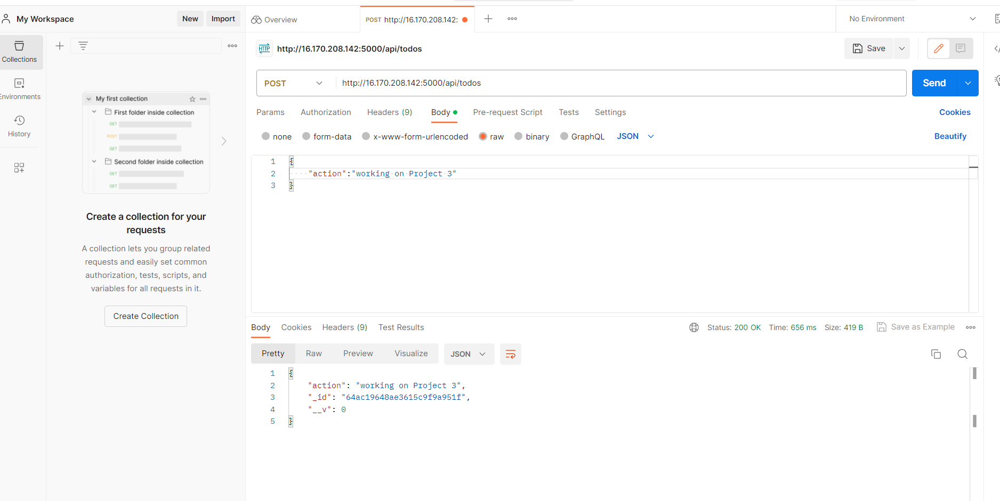

## Documentation for Project 3

# SIMPLE TO-DO APPLICATION ON MERN WEB STACK

`sudo apt update`

`sudo apt upgrade`

*Lets look for location of Node.js software from Ubuntu repositories*

`curl -fsSL https://deb.nodesource.com/setup_18.x | sudo -E bash -`


*Install Node.js with the command below*

`sudo apt-get install -y nodejs`


*verify the node installation*

`node-v`

`npm -v`


# Application Code Setup

*create a new directory*

`mkdir Todo`

`ls`

`cd Todo`

*Next, you will use the command npm init to initialise your project, so that a new file named package.json will be created*

`npm init`


# INSTALL EXPRESSJS

*To use express, install it using npm*

`npm install express`


*Now create a file index.js with the command below*

`touch index.js`

*run ls to confirm that the file was created*

*install the dotenv module*

`npm install dotenv`


*Open the index.js file with the command below*

`vim index.js`

*Type the code below into it and save*


*run the command below to spin your server*

`node index.js`


*Now we need to open this port in EC2 Security Groups*


*Open up your browser and try to access your server’s Public IP or Public DNS name*

*http://<PublicIP-or-PublicDNS>:5000*


# Routes

*We will create a routes folder which will contain code pointing to the three main endpoints used in a todo application. This will contain the post,get and delete requests which will be helpful in interacting with our client_side and database via restful apis*

`mkdir routes`

`cd routes`

`touch api.js`


*Open the file with*

`vim api.js`

*Write the The below code in api.js. It is an example of a simple route that fires various endpoints.*

```
{
  const express = require ('express');
const router = express.Router();

router.get('/todos', (req, res, next) => {

});

router.post('/todos', (req, res, next) => {

});

router.delete('/todos/:id', (req, res, next) => {

})

module.exports = router;
}
```


# MODELS

*We will be creating the models directory which will be used to define our database schema. A Schema is a blueprint of how our database will be structured which include other fields which may not be required to be stored in the database*

`npm install mongoose`


*a new older is then created (models) changed into it and a file named todo.js is also created*

`mkdir models && cd models && touch todo.js`


*Open the file created with `vim todo.js` then paste the code below in the file*

```
{
  const mongoose = require('mongoose');
const Schema = mongoose.Schema;

//create schema for todo
const TodoSchema = new Schema({
action: {
type: String,
required: [true, 'The todo text field is required']
}
})

//create model for todo
const Todo = mongoose.model('todo', TodoSchema);

module.exports = Todo;
}
```

*Since we have defined a schema for how our database should be structured, we then update the code in our `api.js` in the routes folder  to fire specific actions when an endpoint is called

```
{
  const express = require ('express');
const router = express.Router();
const Todo = require('../models/todo');

router.get('/todos', (req, res, next) => {

//this will return all the data, exposing only the id and action field to the client
Todo.find({}, 'action')
.then(data => res.json(data))
.catch(next)
});

router.post('/todos', (req, res, next) => {
if(req.body.action){
Todo.create(req.body)
.then(data => res.json(data))
.catch(next)
}else {
res.json({
error: "The input field is empty"
})
}
});

router.delete('/todos/:id', (req, res, next) => {
Todo.findOneAndDelete({"_id": req.params.id})
.then(data => res.json(data))
.catch(next)
})

module.exports = router;
}
```


# MONGODB DATABASE


*a database to store all information when we make a post request to an endpoint has to be created. We will be using mLab which provides a DBaaS (Database as a service) solution.*


*Create a database and a collection*


*To connect mongoose(application_db) to our database service we connect to it using the connection credential provided by mLab*


*In the index.js file, we specified process.env to access environment variables, but we have not yet created this file. So we will do that now*

`touch .env`

`vi .env`


*Add the connection string to access the database in it, just as below*

*mongodb+srv://Ben:<password>@cluster0.0ynjdj3.mongodb.net/?retryWrites=true&w=majority*

*Now we need to update the index.js to reflect the use of .env so that Node.js can connect to the database by replacing it with the code below*

`vim index.js`


```
{
  const express = require('express');
const bodyParser = require('body-parser');
const mongoose = require('mongoose');
const routes = require('./routes/api');
const path = require('path');
require('dotenv').config();

const app = express();

const port = process.env.PORT || 5000;

//connect to the database
mongoose.connect(process.env.DB, { useNewUrlParser: true, useUnifiedTopology: true })
.then(() => console.log(`Database connected successfully`))
.catch(err => console.log(err));

//since mongoose promise is depreciated, we overide it with node's promise
mongoose.Promise = global.Promise;

app.use((req, res, next) => {
res.header("Access-Control-Allow-Origin", "\*");
res.header("Access-Control-Allow-Headers", "Origin, X-Requested-With, Content-Type, Accept");
next();
});

app.use(bodyParser.json());

app.use('/api', routes);

app.use((err, req, res, next) => {
console.log(err);
next();
});

app.listen(port, () => {
console.log(`Server running on port ${port}`)
});
}
```


*then start your server with the command*

`node index.js`


# Testing Backend Code without Frontend using RESTful API

*In this project, we will use Postman to test our API, Now open your Postman, create a POST request to the API http://<PublicIP-or-PublicDNS>:5000/api/todos. This request sends a new task to our To-Do list so the application could store it in the database.*



*Then We make a GET request to see if we can get back what has been posted into the database*


## STEP 2 – FRONTEND CREATION

*To start out with the frontend of the To-do app, we will use the create-react-app command to scaffold our app*

` npx create-react-app client`

*This will create a new folder in your Todo directory called client, where you will add all the react code*


# Running a React App

*Before testing the react app, there are some dependencies that need to be installed*

*first is the concurrently. It is used to run more than one command simultaneously from the same terminal window*

`npm install concurrently --save-dev`


*then Install nodemon. It is used to run and monitor the server. If there is any change in the server code, nodemon will restart it automatically and load the new changes*


`npm install nodemon --save-dev`


*In Todo folder open the package.json file. Change the highlighted part of the below screenshot and replace with the code below*

```
{
  "scripts": {
"start": "node index.js",
"start-watch": "nodemon index.js",
"dev": "concurrently \"npm run start-watch\" \"cd client && npm start\""
},

}
```


# Configure Proxy in package.json

`cd client`

*open the package.json add the key value pair in the package.json file "proxy": "http://localhost:5000".*

`vi package.json`


*In order to be able to access the application from the Internet you have to open TCP port 3000 on EC2 by adding a new Security Group rule*


*run the below in the Todo directory*

`npm run dev`

*your app should open and start running on localhost:3000*


# Creating your React Components

`cd client`

`cd src`

`mkdir components`


*Inside ‘components’ directory create three files Input.js, ListTodo.js and Todo.js*

`touch Input.js ListTodo.js Todo.js`


*open input.js and paste the following*

```
{
  import React, { Component } from 'react';
import axios from 'axios';

class Input extends Component {

state = {
action: ""
}

addTodo = () => {
const task = {action: this.state.action}

    if(task.action && task.action.length > 0){
      axios.post('/api/todos', task)
        .then(res => {
          if(res.data){
            this.props.getTodos();
            this.setState({action: ""})
          }
        })
        .catch(err => console.log(err))
    }else {
      console.log('input field required')
    }

}

handleChange = (e) => {
this.setState({
action: e.target.value
})
}

render() {
let { action } = this.state;
return (
<div>
<input type="text" onChange={this.handleChange} value={action} />
<button onClick={this.addTodo}>add todo</button>
</div>
)
}
}

export default Input
}
```
*Ensure axios is installed in the client directory*

`npm install axios`


*In the ListTodo.js file of the components directory, insert the following code*

```
{
  import React from 'react';

const ListTodo = ({ todos, deleteTodo }) => {

return (
<ul>
{
todos &&
todos.length > 0 ?
(
todos.map(todo => {
return (
<li key={todo._id} onClick={() => deleteTodo(todo._id)}>{todo.action}</li>
)
})
)
:
(
<li>No todo(s) left</li>
)
}
</ul>
)
}

export default ListTodo
}
```
*Then in your Todo.js file you write the following code*

```
{
  import React, {Component} from 'react';
import axios from 'axios';

import Input from './Input';
import ListTodo from './ListTodo';

class Todo extends Component {

state = {
todos: []
}

componentDidMount(){
this.getTodos();
}

getTodos = () => {
axios.get('/api/todos')
.then(res => {
if(res.data){
this.setState({
todos: res.data
})
}
})
.catch(err => console.log(err))
}

deleteTodo = (id) => {

    axios.delete(`/api/todos/${id}`)
      .then(res => {
        if(res.data){
          this.getTodos()
        }
      })
      .catch(err => console.log(err))

}

render() {
let { todos } = this.state;

    return(
      <div>
        <h1>My Todo(s)</h1>
        <Input getTodos={this.getTodos}/>
        <ListTodo todos={todos} deleteTodo={this.deleteTodo}/>
      </div>
    )

}
}

export default Todo;
}
```

*In the src folder , in the  App.js file which encapsulates all other components. Paste the below code*

```
{
  import React from 'react';

import Todo from './components/Todo';
import './App.css';

const App = () => {
return (
<div className="App">
<Todo />
</div>
);
}

export default App;
}
```

*In same directory, in App.css and insert the following code*

```
{
  .App {
text-align: center;
font-size: calc(10px + 2vmin);
width: 60%;
margin-left: auto;
margin-right: auto;
}

input {
height: 40px;
width: 50%;
border: none;
border-bottom: 2px #101113 solid;
background: none;
font-size: 1.5rem;
color: #787a80;
}

input:focus {
outline: none;
}

button {
width: 25%;
height: 45px;
border: none;
margin-left: 10px;
font-size: 25px;
background: #101113;
border-radius: 5px;
color: #787a80;
cursor: pointer;
}

button:focus {
outline: none;
}

ul {
list-style: none;
text-align: left;
padding: 15px;
background: #171a1f;
border-radius: 5px;
}

li {
padding: 15px;
font-size: 1.5rem;
margin-bottom: 15px;
background: #282c34;
border-radius: 5px;
overflow-wrap: break-word;
cursor: pointer;
}

@media only screen and (min-width: 300px) {
.App {
width: 80%;
}

input {
width: 100%
}

button {
width: 100%;
margin-top: 15px;
margin-left: 0;
}
}

@media only screen and (min-width: 640px) {
.App {
width: 60%;
}

input {
width: 50%;
}

button {
width: 30%;
margin-left: 10px;
margin-top: 0;
}
}
}
```

*in the index.css file and insert the below code*

```
{
  body {
margin: 0;
padding: 0;
font-family: -apple-system, BlinkMacSystemFont, "Segoe UI", "Roboto", "Oxygen",
"Ubuntu", "Cantarell", "Fira Sans", "Droid Sans", "Helvetica Neue",
sans-serif;
-webkit-font-smoothing: antialiased;
-moz-osx-font-smoothing: grayscale;
box-sizing: border-box;
background-color: #282c34;
color: #787a80;
}

code {
font-family: source-code-pro, Menlo, Monaco, Consolas, "Courier New",
monospace;
}
}
```
*back to the Todo directory and run*

`npm run dev`


